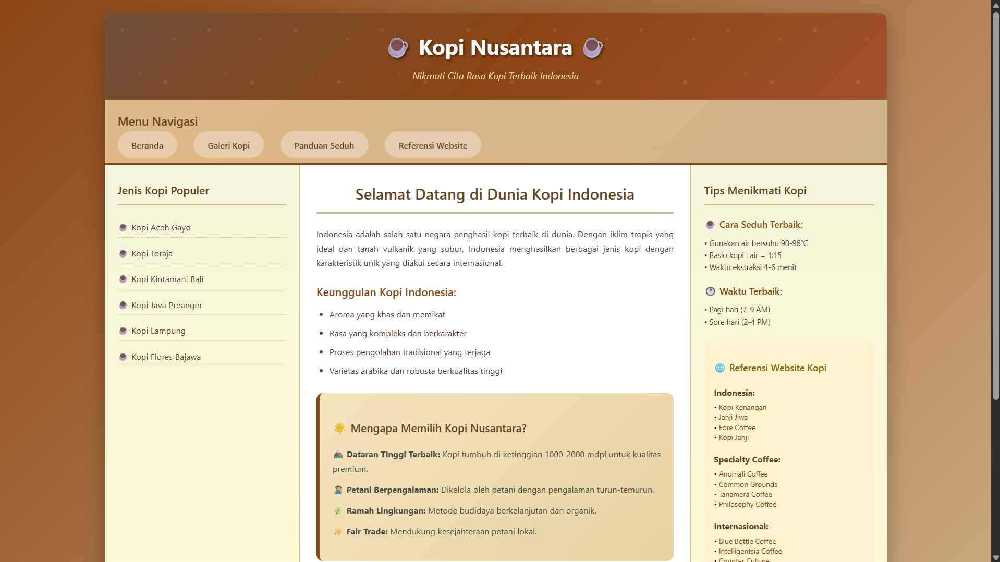
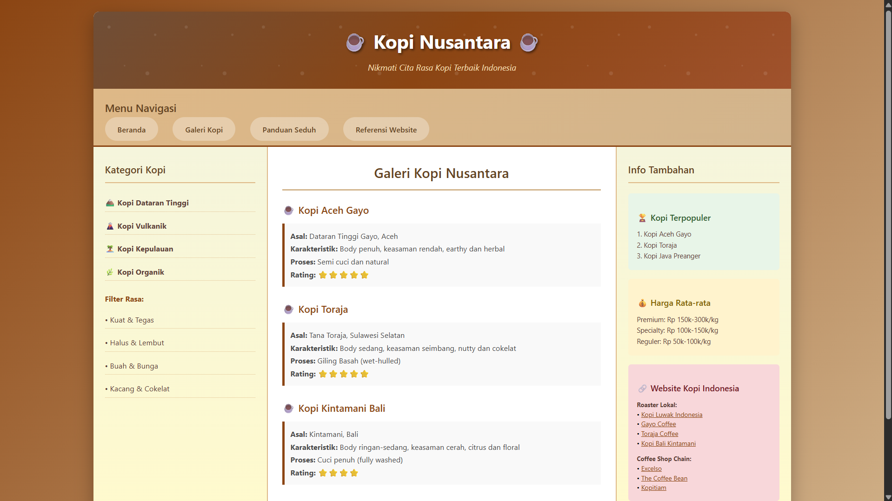
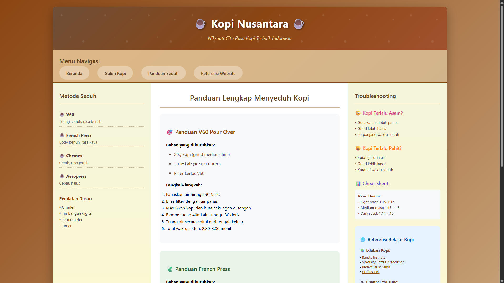
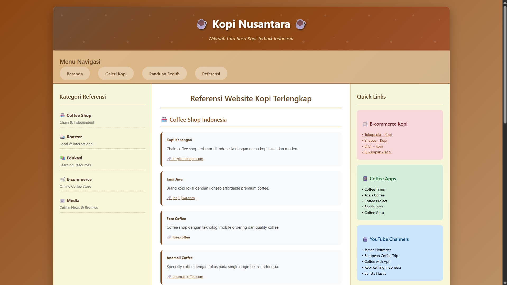

# 🎯 SIB Fullstack Web Developer - Desain Web Pertemuan 5

Website informasi tentang kopi Indonesia dengan layout CSS yang mengikuti struktur grid 3 kolom sesuai dengan tugas Layout CSS.

## 📁 **Download Project**
🔗 **GitHub Repository**: [https://github.com/ekomh170/sib-nfa-desain-web-fwb/tree/desain-web-pertemuan-5](https://github.com/ekomh170/sib-nfa-desain-web-fwb/tree/desain-web-pertemuan-5)

### 📄 Halaman Website

#### 1. 🏠 **Beranda** (`index.html`)
 

#### 2. 🖼️ **Galeri Kopi** (`gallery.html`) 
 

#### 3. 📚 **Panduan Seduh** (`study.html`)
 

#### 4. 🔗 **Referensi Website** (`references.html`)
 