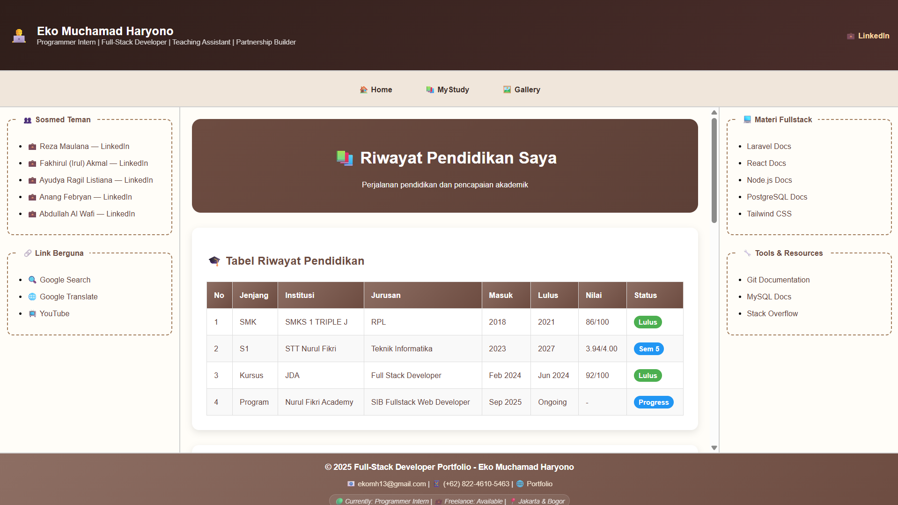
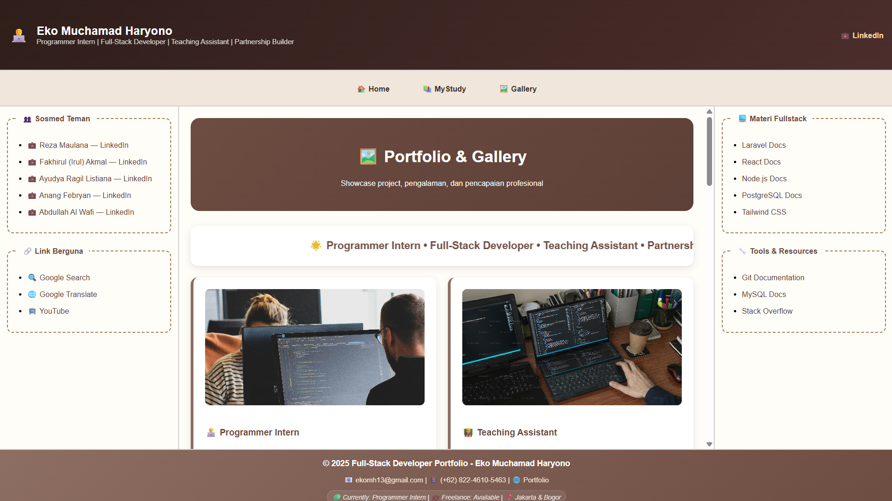

# 🎯 SIB Fullstack Web Developer - Desain Web Pertemuan 3

## 📋 **Layout Frame Portfolio Website**

Tugas praktikum **Desain Web Pertemuan 3** - Portfolio website sederhana menggunakan **HTML5 Frameset** untuk implementasi layout frame dengan struktur dan styling CSS.

## 📁 **Download Project**
🔗 **GitHub Repository**: [https://github.com/ekomh170/sib-nfa-desain-web-fwb/tree/desain-web-pertemuan-3](https://github.com/ekomh170/sib-nfa-desain-web-fwb/tree/desain-web-pertemuan-3)

## 📸 **Website Preview**

### 🏠 **Home Page**

*Landing page dengan hero section dan informasi personal*

### 📚 **Study Page** 

*Halaman riwayat pendidikan dan prestasi akademik*

### 🖼️ **Portfolio Page**

*Showcase portfolio dan pengalaman kerja profesional*

### 🏗️ **Struktur Website**

```
index.html (Main Frameset)
├── header.html     (120px height - Personal branding)  
├── nav.html        (60px height - Navigation menu)
├── content area    (Flexible height)
│   ├── left.html   (20% width - Social links) 
│   ├── main area   (60% width - Dynamic content)
│   │   ├── home.html    (Hero & personal info)
│   │   ├── study.html   (Education & achievements)  
│   │   └── gallery.html (Portfolio & experience)
│   └── right.html  (20% width - Tech resources)
└── footer.html     (90px height - Contact info)
```