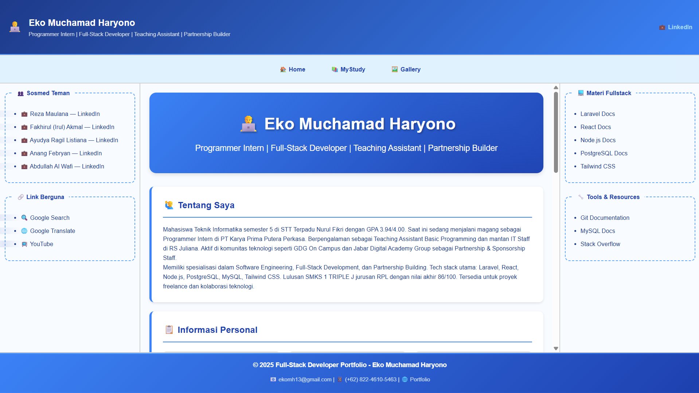
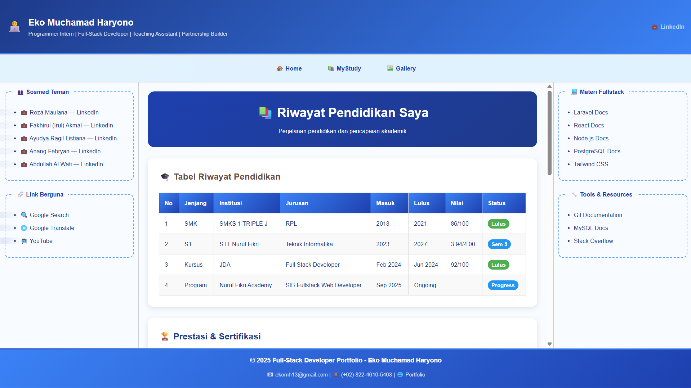
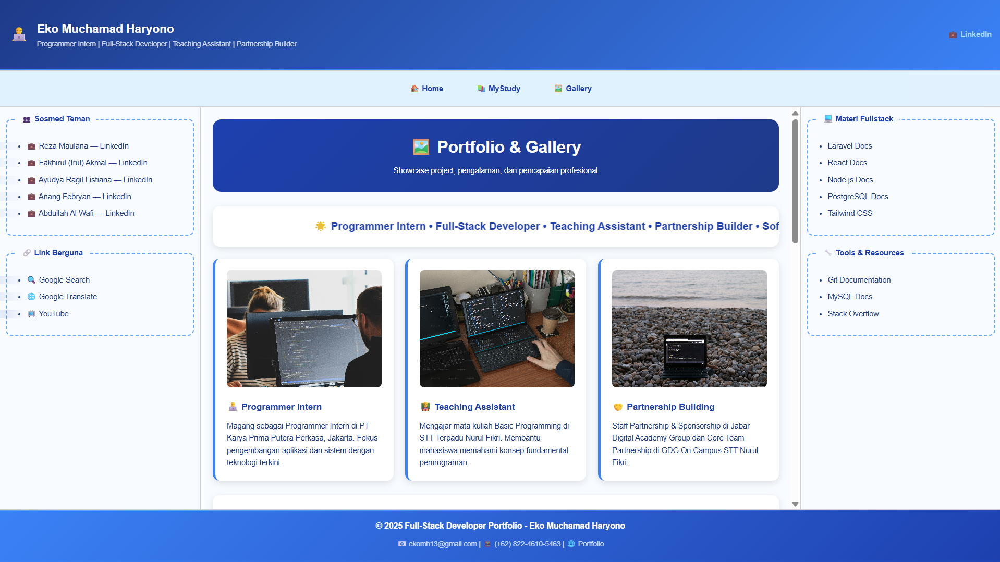

# 🎯 SIB Fullstack Web Developer - Desain Web Pertemuan 4

## 🎨 **CSS Styling Portfolio Website**

Tugas praktikum **Desain Web Pertemuan 4** - Penataan ulang portfolio website dari Tugas 3 menggunakan **CSS3** untuk membuat halaman web yang lebih menarik dan modern.

## 📁 **Download Project**
🔗 **GitHub Repository**: [https://github.com/ekomh170/sib-nfa-desain-web-fwb/tree/desain-web-pertemuan-4](https://github.com/ekomh170/sib-nfa-desain-web-fwb/tree/desain-web-pertemuan-4)

## 📊 **Kriteria Penilaian**

- 🎨 **CSS di seluruh page latihan** - Bobot **70%**
- 🎨 **CSS di sebagian latihan** - Bobot **30%**

## 📸 **Website Preview**

### 🏠 **Home Page**

*Landing page dengan hero section dan informasi personal*

### 📚 **Study Page** 

*Halaman Study pendidikan dan prestasi akademik*

### 🖼️ **Galeri Page**

*Showcase galeri dan pengalaman kerja profesional*
